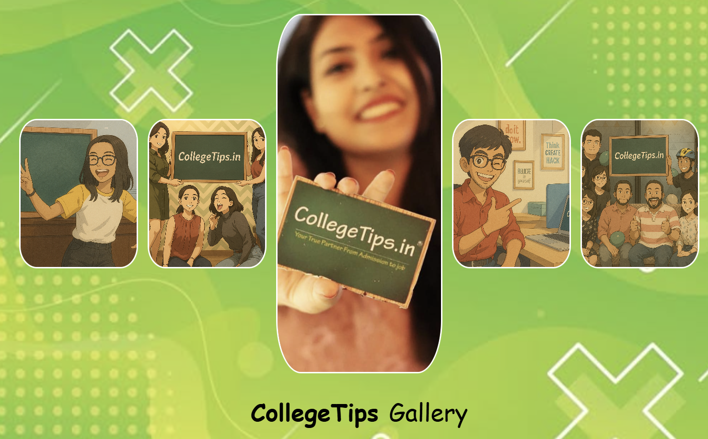
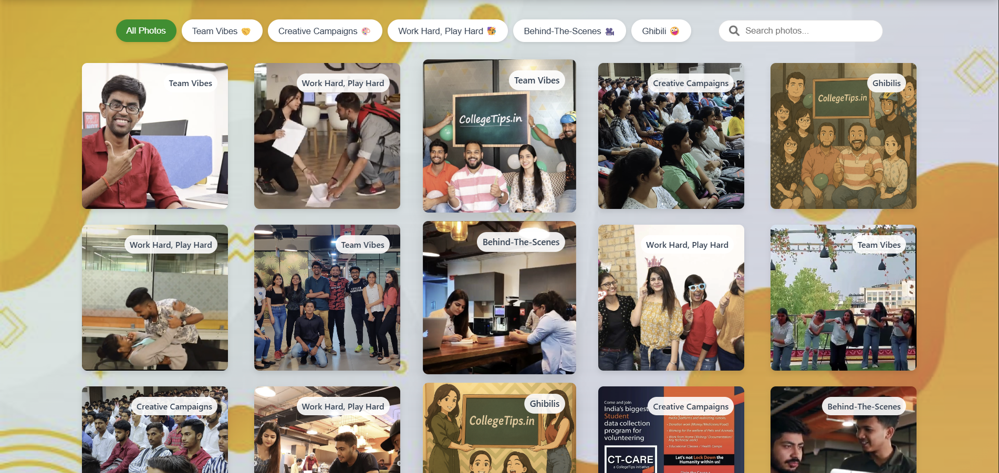

# CollegeTips Photo Booth



An interactive, responsive photo gallery for CollegeTips website featuring team moments, campaigns, and behind-the-scenes content.

## Features

✨ **Interactive Gallery**
- Hover effects with zoom animations
- Fullscreen lightbox view with navigation
- Category filtering system
- Search functionality

🎨 **Visual Design**
- Dynamic header with 5 interactive profile images
- Dual background system (page + header)
- Responsive layout (5 columns on desktop → 2 columns on mobile)
- Modern card-based design with overlays

📱 **Responsive Experience**
- Mobile-first design approach
- Adaptive image grids
- Touch-friendly interactions
- Optimized for all screen sizes


## Technologies Used

- **HTML5** - Semantic markup
- **CSS3** - Flexbox, Grid, animations
- **JavaScript** - Interactive functionality
- **Font Awesome** - Icon set

## File Structure

collegetips-gallery/

├── index.html # Main HTML file

├── styles.css # All styling

├── script.js # Gallery functionality

├── images/ # Image assets

│ ├── header/ # Header circle images

│ ├── backgrounds/ # Background images

│ └── gallery/ # Gallery content images

└── README.md # This file


## Setup Instructions

1. Clone the repository:
   ```bash
   git clone https://github.com/yourusername/collegetips-gallery.git

